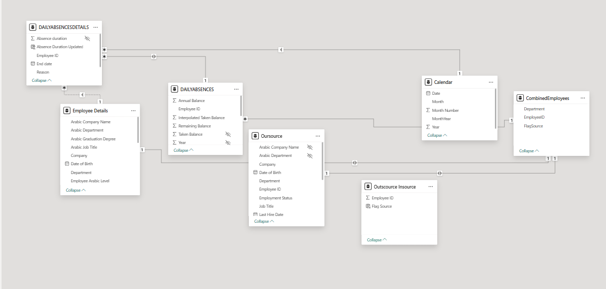

# Power BI Workforce Analytics Dashboard
**Business Intelligence Internship · EFG Holding · Cairo, Egypt · 2025**

> ⚠️ Source data is confidential and not included in this repository.
> This README documents the full data model, DAX logic, and business decisions behind the dashboard.

---

## Business Problem

HR attendance data across thousands of employees was stored in disconnected 
raw files with no unified view. Management had no way to:
- Compare absence patterns across departments or job titles
- Distinguish between Insource vs. Outsource workforce behaviour
- Track whether absence was driven by sick leave, annual leave, or other reasons
- Monitor attendance rates against a working-day baseline

The goal was to consolidate this into a single interactive Power BI dashboard 
that non-technical stakeholders could use daily.

---

## Data Model



The model uses a **star schema** with 7 tables:

| Table | Type | Description |
|---|---|---|
| `DAILYABSENCESDETAILS` | Fact | One row per absence event — duration, reason, employee, dates |
| `DAILYABSENCES` | Fact | Leave balance summary — annual, taken, remaining per employee |
| `Employee Details` | Dimension | Employee master data — department, job title, company, grade |
| `Oursource` | Dimension | Outsourced employee records — status, hire date, department |
| `Outscource Insource` | Bridge | Flags each employee ID as insource or outsource |
| `CombinedEmployees` | Helper | Unified employee list across insource/outsource for cross-filtering |
| `Calendar` | Calculated | Auto-generated date table with Year, Month, MonthYear columns |

### Key Relationships
- `DAILYABSENCESDETAILS` → `Employee Details` via `Employee ID` (Many-to-One)
- `DAILYABSENCESDETAILS` → `DAILYABSENCES` via `Employee ID` (Many-to-One)
- `DAILYABSENCESDETAILS` → `Calendar` via date (Many-to-One)
- `Outscource Insource` bridges both workforce dimensions for unified headcount

---

## DAX Measures

### Calendar Table (Calculated)
```dax
Calendar = 
ADDCOLUMNS(
    CALENDAR(
        MIN(DAILYABSENCESDETAILS[Start date]), 
        MAX(DAILYABSENCESDETAILS[Start date])
    ),
    "Year",        YEAR([Date]),
    "Month",       FORMAT([Date], "MMMM"),
    "Month Number", MONTH([Date]),
    "MonthYear",   FORMAT([Date], "MMM YYYY")
)
```
> Dynamically scoped to the actual date range of the data — no hardcoded years.

---

### Attendance Rate (Insource)
```dax
Attendance Rate Insource = 
VAR TotalWorkDays = 220
VAR InsourceEmployeeIDs =
    VALUES(DAILYABSENCESDETAILS[Employee ID])
VAR DaysAbsent =
    CALCULATE(
        SUM(DAILYABSENCESDETAILS[Absence Duration Updated]),
        KEEPFILTERS(InsourceEmployeeIDs)
    )
VAR TotalInsourceEmployees =
    CALCULATE(
        DISTINCTCOUNT(DAILYABSENCESDETAILS[Employee ID]),
        KEEPFILTERS(InsourceEmployeeIDs)
    )
VAR AttendanceRate =
    1 - (DaysAbsent / (TotalInsourceEmployees * TotalWorkDays))
RETURN
    FORMAT(AttendanceRate, "Percent")
```
> Uses KEEPFILTERS to respect slicer context while calculating the rate 
> against a fixed 220 working-day baseline per employee.

---

### Absence Breakdown by Reason
```dax
Annual Leave % = 
DIVIDE(
    CALCULATE(
        SUM(DAILYABSENCES[Taken Balance]), 
        DAILYABSENCESDETAILS[Reason] = "Annual"
    ), 
    SUM(DAILYABSENCES[Taken Balance]), 
    0
)

Sick Leave % = 
DIVIDE(
    CALCULATE(
        SUM(DAILYABSENCES[Taken Balance]), 
        DAILYABSENCESDETAILS[Reason] = "Sick Leave"
    ), 
    SUM(DAILYABSENCES[Taken Balance]), 
    0
)

Common Reason = 
FIRSTNONBLANK(
    TOPN(
        1, 
        VALUES(DAILYABSENCESDETAILS[Reason]),
        CALCULATE(COUNTROWS(DAILYABSENCES)), 
        DESC
    ), 1
)
```

---

### Absence % by Job Title
```dax
Absence % by Job Title (Insource) = 
DIVIDE(
    [Absence Count Insource],
    [Total Absences Insource],
    0
)

Total Absences Insource = 
CALCULATE(
    COUNTROWS(DAILYABSENCESDETAILS),
    ALL('Employee Details'[Job Title])
)

Job Title % = 
DIVIDE(
    COUNTROWS('AllJobTitles'),
    CALCULATE(COUNTROWS('AllJobTitles'), ALL('AllJobTitles'))
)
```
> Removes Job Title filter context in the denominator to calculate 
> each title's share of total absences — enables fair cross-title comparison.

---

### Headcount Measures
```dax
Total Employees       = DISTINCTCOUNT('Outscource Insource'[Employee ID])
TotalAbsenceDays      = SUM(DAILYABSENCESDETAILS[Absence Duration Updated])
Total Employees Check = CALCULATE(DISTINCTCOUNT(CombinedDemographic[EmployeeID]))
```

---

## KPIs Tracked in the Dashboard

| KPI | DAX Measure | Business Use |
|---|---|---|
| Attendance Rate | `Attendance Rate Insource` | Flag departments below threshold |
| Total Absence Days | `TotalAbsenceDays` | Volume of lost working days |
| Annual Leave % | `Annual Leave %` | Planned vs. unplanned absence split |
| Sick Leave % | `Sick Leave %` | Unplanned absence pressure |
| Most Common Reason | `Common Reason` | Top absence driver at a glance |
| Absence by Job Title | `Absence % by Job Title` | Role-level risk identification |
| Total Headcount | `Total Employees` | Denominator validation across slicers |

---

## Design Decisions

**Why separate Insource and Outsource?**  
The two workforce types have different contracts, leave entitlements, and 
cost structures. Mixing them in a single measure would distort the attendance 
rate and make departmental comparisons misleading.

**Why a calculated Calendar table?**  
Source data had no date dimension. A calculated Calendar table scoped 
dynamically to the data range enables time intelligence (month-over-month, 
year filtering) without manual maintenance.

**Why KEEPFILTERS in Attendance Rate?**  
Standard CALCULATE would override slicer context. KEEPFILTERS preserves 
the user's department or job title filter while still computing the 
correct per-employee baseline.

---

## Tools Used
- Power BI Desktop
- DAX (DIVIDE, CALCULATE, KEEPFILTERS, TOPN, FIRSTNONBLANK, ADDCOLUMNS)
- Power Query (M) for data cleaning and table merging
- Excel (source data format)

---

*Built during a Business Intelligence Internship at EFG Holding, Cairo, Egypt.*  
*Consolidated 15,567 rows of raw attendance data. Reduced weekly reporting time by 30%.*  
*All source data removed from this repository.*
